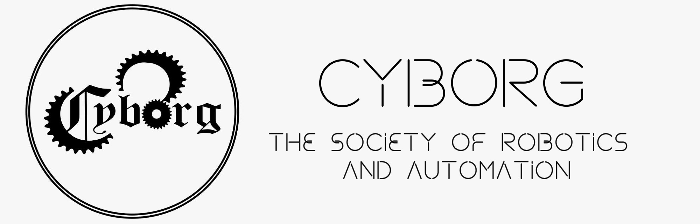

# DRONE ORBIT


## Prerequisites
- Ubuntu 16.04 or newer (Ubuntu 18.04 recommended)
- [ROS Kinetic ](http://wiki.ros.org/kinetic/Installation/Ubuntu) (Ubuntu 16.04) or [ROS Melodic ](http://wiki.ros.org/melodic/Installation/Ubuntu) (Ubuntu 16.04)
- [Catkin Tools](https://catkin-tools.readthedocs.io/en/latest/installing.html)

## Hector Quadrotor Installation
- Download hector_quadrotor repository by running this command inside the workspace
```sh
$ cd <workspace_name>
$ wstool init src https://raw.github.com/tu-darmstadt-ros-pkg/hector_quadrotor/kinetic-devel/tutorials.rosinstall
```

- Install all required dependancies by running this command inside the workspace
```sh
$ sudo apt install ros-<ROSDISTRO>-uuv-simulator
$ cd ~/<workspace_name>
$ rosdep install --from-paths src --ignore-src -r -y
```

- (Optional) Download teleop_twist_keyboard to control the quadrotor from keyboard (replace ROSDISTRO with kinetic/melodic/neotic)
```sh
$ sudo apt-get install ros-<ROSDISTRO>-teleop-twist-keyboard
```

## Build
Build all the packages by running this inside your workspace
```sh
$ catkin build
```

### Running the package
- To launch the practice arena along and spawn the hector_quadrotor at the same time use:
```sh	
$ roslaunch drone_orbit practice_arena_with_drone.launch
```		
- Sometimes the above doesn't work. Then launch the practice arena first using:
```sh	
$ roslaunch drone_orbit practice_arena.launch
```		
- Then, spawn the hector_quadrotor using:
```sh	
$ roslaunch hector_quadrotor_gazebo spawn_quadrotor_with_cam.launch
```		
- Initially the motors are not enabled, to enable run this command in another terminal:
```sh
$ rosservice call /enable_motors "enable: true"
```	
- And lastly to control the quadrotor using keyboard run the below command:
```sh
$ rosrun teleop_twist_keyboard teleop_twist_keyboard.py
```

### Todos

 - Explore hector_quadrotor

License
----

MIT

